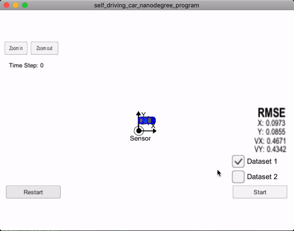
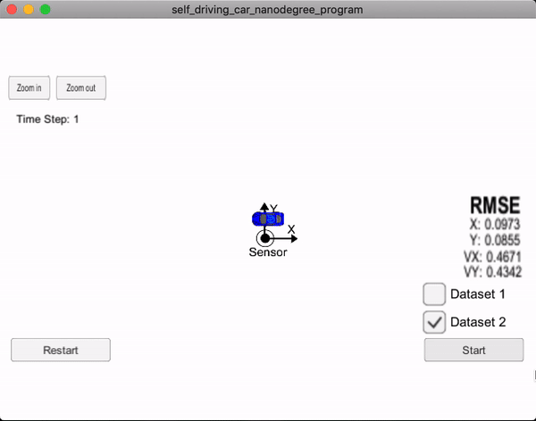

#Extended Kalman Filters
| Dataset #1  | Dataset #2  |
|---|---|
|   |   |
| [video 1](dataset1.mov)    | [video 2](dataset2.mov)    |

Once the install for uWebSocketIO is complete:

1. ```mkdir build```
2. ```cd build```
3. ```cmake ..```
    - sometimes you may want to specify compilers manually for example :
        ```cmake -D CMAKE_C_COMPILER=clang -D CMAKE_CXX_COMPILER=clang++  ..```
4. ```make```
5. ```./ExtendedKF```

## Accuracy

This implementation meets accuracy requirement: ```RMSE <= [.11, .11, 0.52, 0.52]``` 

## Follows the Correct Algorithm

1. Implementation follows defined steps for the Kalman filter.
2. The algorithm uses the first measurements to initialize the state vectors and covariance matrices. 
3. Upon receiving a measurement after the first, the algorithm predicts the object position to the current timestep and then update the prediction using the new measurement.
4. The algorithm sets up the appropriate matrices given the type of measurement and calls the correct measurement function for a given sensor type.
